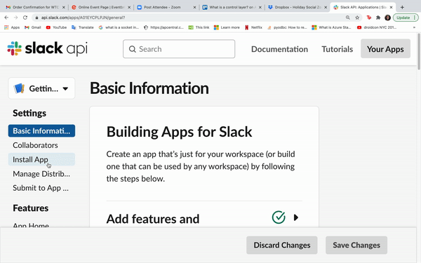

# Building Your Own App

Now it is time to put everything to practice! In this issue, you will be building your own app that:

- listens for a user joining a team
- sends a message in a specific channel asking them to introduce themselves

## 🔨Setup

In order to focus on the coding aspect, this issue will walk you through the set up and specifications for the app. Start a new project by [creating a new app](https://api.slack.com/apps?new_app=1). When creating your app, it will also be helpful to make a new workspace for testing.

### Access Credentials

The first thing you need to do is link your program to your app! The two peices of information you'll need to do this are a **slack bot token** and a **slack signing secret**. Refer to the gifs below to locate each of these properties from the Slack dashboard:





### Scopes and Events

Under OAuth & Permissions, scroll down to the **Bot Token Scopes** field and select **Add an OAuth Scope**. From there, add **chat:write** and install the app to workspace. This will enable your app to write messages in chats. 

Next, you will need to configure allow the app to listen for new messages in a channel. To do this, go to **Event Subscriptions** and select **messages.channels**.

> **Note:** enable event subscriptions, you will need to have a public facing url. If you have not already, [install and run ngrok](https://api.slack.com/tutorials/tunneling-with-ngrok) to create a url. Then copy and paste the url into the  **request url** field under Event Subscriptions.

### Local Environment

Now that you have the basics set up, you need to configure your **local environment**. Having some sort of a text editor or IDE will be very helpful in order to code locally, but is not required.  

Create a folder for the app, and then navigate to the folder in your terminal. To install all the necessary packages for the app, call the following command:

```javascript
npm init
```

Click enter for each prompt that pops up, then call **ls** in the terminal to list all of the files in your directory. You should have a new file called **package.json**. 

Next, you will be saving your bot token and signing secret as environment variables. This step is *extremely* important for two reasons:

1. telling your local environment which slack app it is connected to 
2. ensuring that you don't accidentally show sensitive credentials in a screenshot or distributing code

Call the following commands in your terminal and refer to previous instructions on getting the credentials:

```bash
export SLACK_SIGNING_SECRET=<your-signing-secret>
```

```bash
export SLACK_BOT_TOKEN=xoxb-<your-bot-token>
```

Lastly, use the commands to install the **@slack/bolt** package and create your app:

```bash
npm install @slack/bolt
touch app.js
```


## ⚡️Coding

Now its time to get coding! You will create a program that:

- listens for a new member
- sends a message in a specific channel asking them to introduce themselves

### Setting up environment variables

The first thing you need to do is select dependencies and access the environment variables you created! Copy and paste the following code to do this:

```javascript
const { App } = require('@slack/bolt');

// Initializes your app with your bot token and signing secret
const app = new App({
  token: process.env.SLACK_BOT_TOKEN,
  signingSecret: process.env.SLACK_SIGNING_SECRET
});
```

You will also be adding this snippet to be notified when the app runs:

```javascript
(async () => {
  // Start your app
  await app.start(process.env.PORT || 3000);

  console.log('⚡️ Bolt app is running!');
})();
```


### Listening for a user

In order to listen for new members, you will need to call app.event() in your javascript file. Here is the boilerplate for the function call:

```javascript
app.event('<your-event-here>', async ({ event, client }) => {
  try {
  
  }
  catch (error) {
    console.error(error);
  }
});
```

Go to the [Slack Events API](https://api.slack.com/events) and find the event for when someone new joins a workspace. Replace the current event in the function call with the event name you found.


### Messaging in the channel

Now it's time to create a new channel to remind new members to introduce themselves. To do this, [create a channel](https://slack.com/help/articles/201402297-Create-a-channel) in your workspace and open it up. In your browser URL, you can find the channel ID as the only code starting with a 'C'.


Make sure to save this ID as a **global variable**. To actually message the user, look over [this documentation](https://api.slack.com/methods/chat.postMessage) on the Slack API. Call the method, then place it within the try-catch statement to put it into effect. 

> **Note:** make sure to print the method to the console for testing purposes

When finished, reinstall the app to your workspace. If you have any or need some help, feel free to reach out to your TAs!

